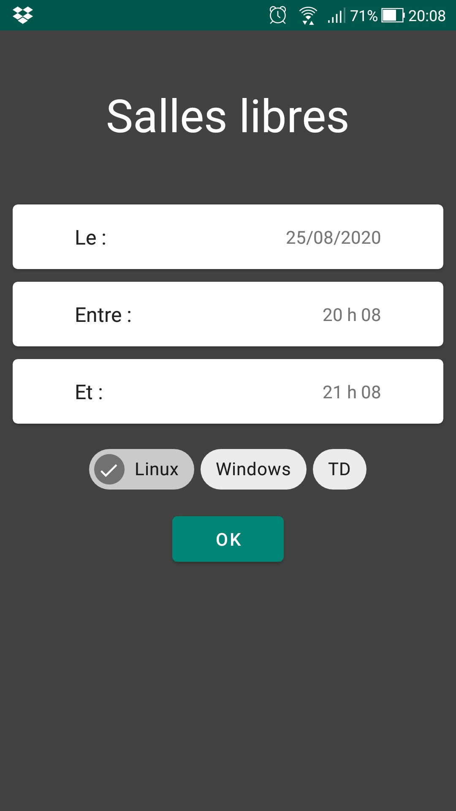
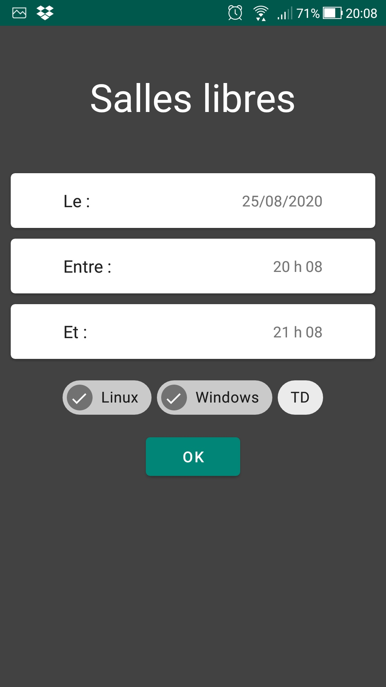
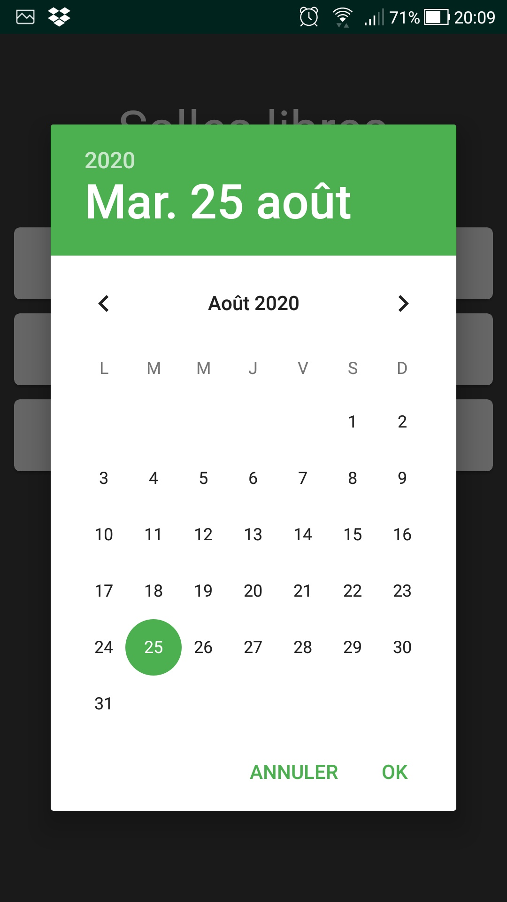
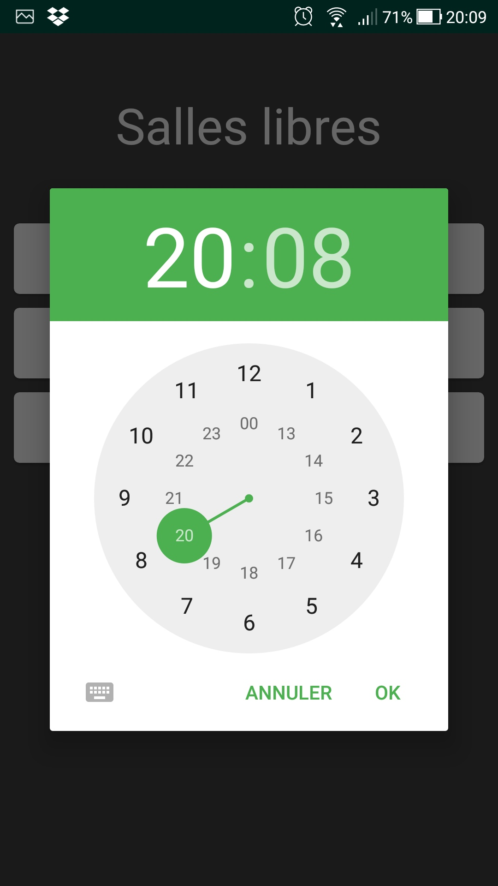

# FreeRoomFinder
An android app that list free rooms during a set interval of time base on an ical calendar url. This is a Kotlin, better code and more widely compatible of my previous "FreeTpRoom". 

  
  
  
  
  
  

